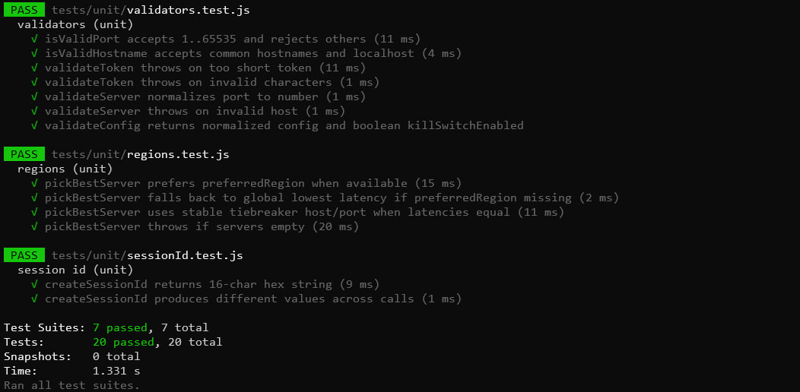

# Задание 2 : VPN-тема + тесты на Jest

Проект — демонстрационный  “VPN connection manager” (логика выбора сервера, валидация конфигурации, kill‑switch, состояния подключения) + тесты на **Jest**:

- **10+ unit tests** (папка `tests/unit`)
- **2 functional tests** (папка `tests/functional`)


## Стек

- Node.js 18+ 
- Jest

## Установка и запуск

```bash
npm install
npm test
```

Отдельно:
```bash
npm run test:unit
npm run test:functional
npm run coverage
```

## Что считается unit tests 

Unit‑тесты проверяют отдельные функции/классы, без “склейки” в целый сценарий:
- валидация токена/хоста/порта (`src/validators.js`)
- выбор лучшего сервера по региону/latency (`src/regions.js`)
- трекер трафика/квоты (`src/usage.js`)
- kill‑switch (`src/killSwitch.js`)
- генерация sessionId (`src/connection.js`)

## Что считается functional tests 

Functional‑тесты проверяют “цепочку” поведения:
- connect → connected → disconnect, проверка состояний + attachments логики (kill‑switch)
- конфиг из env → connect → reconnect, проверка инвариантов и смены sessionId

## Результаты тестирования (скриншоты)

1) Запусти тесты:
```bash
npm test
```


```md

```

## Структура проекта

- `src/` — код
- `tests/unit/` — юнит‑тесты (10+)
- `tests/functional/` — функциональные тесты (2)
- `docs/screenshots/` — место для скриншота результатов тестов
